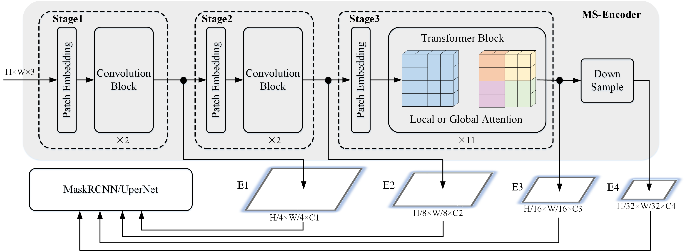

# ConvMAE: Masked Convolution Meets Masked Autoencoders

This folder contains the implementation of the ConvMAE transfer learning for object detection on COCO.

## Pipeline




## Model Zoo
| Models | Pretrain | Pretrain Epochs | Finetune Epochs | #Params(M)| FLOPs(T) | box AP | mask AP | logs/weights |
| :---: | :---: | :---: |:---: | :---: | :---: | :---: | :---: | :---: |
| ConvMAE-B | IN1K w/o lables | 1600 | 25 | 104 | 0.9 | 53.2 | 47.1 | [log](https://drive.google.com/file/d/1vQ9ps-TxeS_8BRfSWZh-X-5Kki7mgIgR/view?usp=sharing)/[weight](https://drive.google.com/file/d/17gy2mlrRVpIlQN9ERSHh98VkHhWINn-m/view?usp=sharing) |

## Usage

### Install
- Clone this repo:

```bash
git clone https://github.com/Alpha-VL/ConvMAE
cd ConvMAE/DET
```

- Create a conda environment and activate it:
```
conda create -n mimdet python=3.9
conda activate mimdet
```
* Install `torch==1.9.0` and `torchvision==0.10.0`
* Install [`Detectron2==0.6`](https://github.com/facebookresearch/detectron2), follow [d2 doc](https://detectron2.readthedocs.io/tutorials/install.html).
* Install [`timm==0.4.12`](https://github.com/rwightman/pytorch-image-models), follow [timm doc](https://fastai.github.io/timmdocs/).
* Install [`einops`](https://github.com/arogozhnikov/einops), follow [einops repo](https://github.com/arogozhnikov/einops#installation--).
* Prepare [`COCO`](https://cocodataset.org/#home) dataset, follow [d2 doc](https://detectron2.readthedocs.io/en/latest/tutorials/builtin_datasets.html).

### Data preparation
You can download the COCO-2017 [here](https://cocodataset.org) and prepare the COCO follow this format:

```tree data
├── data
│   ├── coco
│   │   ├── annotations
│   │   ├── train2017
│   │   ├── val2017
│   │   ├── test2017
```
It is suggested to link the data path as:
```bash
export DETECTRON2_DATASETS=/path/to/data
```

### Evaluation
Download the finetuned model [here](https://drive.google.com/file/d/17gy2mlrRVpIlQN9ERSHh98VkHhWINn-m/view?usp=sharing).

```
# inference
python lazyconfig_train_net.py --config-file <CONFIG_FILE> --num-gpus <GPU_NUM> --eval-only train.init_checkpoint=<MODEL_PATH>
```


### Training
Download the pretrained ConvMAE model [here](https://drive.google.com/file/d/1AEPivXw0A0b_m5EwEi6fg2pOAoDr8C31/view?usp=sharing). 
 
```
# single-machine training
python lazyconfig_train_net.py --config-file <CONFIG_FILE> --num-gpus <GPU_NUM> model.backbone.bottom_up.pretrained=<PRETRAINED_MODEL_PATH>

# multi-machine training
python lazyconfig_train_net.py --config-file <CONFIG_FILE> --num-gpus <GPU_NUM> --num-machines <MACHINE_NUM> --master_addr <MASTER_ADDR> --master_port <MASTER_PORT> model.backbone.bottom_up.pretrained=<PRETRAINED_MODEL_PATH>
```
