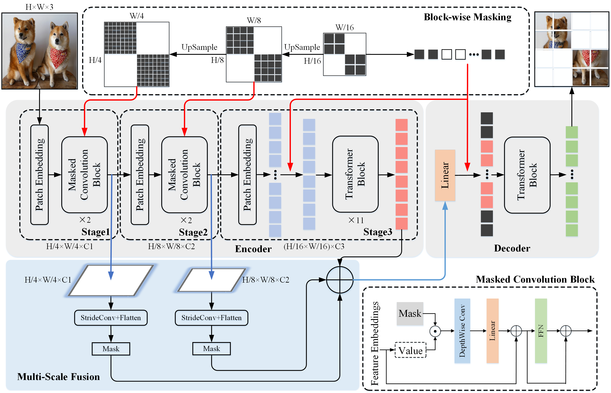

<div align="center">
<h3>[NeurIPS 2022] MCMAE: Masked Convolution Meets Masked Autoencoders</h3>

[Peng Gao](https://scholar.google.com/citations?user=miFIAFMAAAAJ&hl=en&oi=ao)<sup>1</sup>, [Teli Ma](https://scholar.google.com/citations?user=arny77IAAAAJ&hl=en&oi=ao)<sup>1</sup>, [Hongsheng Li](https://scholar.google.com/citations?user=BN2Ze-QAAAAJ&hl=en&oi=ao)<sup>2</sup>, [Ziyi Lin](https://scholar.google.com/citations?user=-VOnnzUAAAAJ&hl=en)<sup>2</sup>, [Jifeng Dai](https://scholar.google.com/citations?user=SH_-B_AAAAAJ&hl=en&oi=ao)<sup>3</sup>, [Yu Qiao](https://scholar.google.com/citations?user=gFtI-8QAAAAJ&hl=en&oi=ao)<sup>1</sup>,

<sup>1</sup> [Shanghai AI Laboratory](https://www.shlab.org.cn/), <sup>2</sup> [MMLab, CUHK](https://mmlab.ie.cuhk.edu.hk/), <sup>3</sup> [Sensetime Research](https://www.sensetime.com/cn).

</div>

\* We change the project name from **ConvMAE** to **MCMAE**.

This repo is the official implementation of [MCMAE: Masked Convolution Meets Masked Autoencoders](https://arxiv.org/abs/2205.03892). It currently concludes codes and models for the following tasks:
> **ImageNet Pretrain**: See [PRETRAIN.md](PRETRAIN.md).\
> **ImageNet Finetune**: See [FINETUNE.md](FINETUNE.md).\
> **Object Detection**: See [DETECTION.md](DET/DETECTION.md).\
> **Semantic Segmentation**: See [SEGMENTATION.md](SEG/SEGMENTATION.md). \
> **Video Classification**: See [VideoConvMAE](https://github.com/Alpha-VL/VideoConvMAE).

## Updates

***15/Sep/2022***

Paper accepted at NeurIPS 2022.

***9/Sep/2022***

ConvMAE-v2 pretrained checkpoints are released.

***21/Aug/2022***

[Official-ConvMAE-Det](https://github.com/OpenGVLab/Official-ConvMAE-Det) which follows official ViTDet codebase is released. 

***08/Jun/2022***

🚀FastConvMAE🚀: significantly accelerates the pretraining hours (4000 single GPU hours => 200 single GPU hours). The code is going to be released at [FastConvMAE](https://github.com/Alpha-VL/FastConvMAE).

***27/May/2022***

1. The supported codes for ImageNet-1K pretraining.
2. The supported codes and models for semantic segmentation are provided.

***20/May/2022***

Update results on video classification.

***16/May/2022***

The supported codes and models for COCO object detection and instance segmentation are available.

***11/May/2022***

1. Pretrained models on ImageNet-1K for ConvMAE.
2. The supported codes and models for ImageNet-1K finetuning and linear probing are provided.

***08/May/2022***

The preprint version is public at [arxiv](https://arxiv.org/abs/2205.03892).

## Introduction
ConvMAE framework demonstrates that multi-scale hybrid convolution-transformer can learn more discriminative representations via the mask auto-encoding scheme. 
* We present the strong and efficient self-supervised framework ConvMAE, which is easy to implement but show outstanding performances on downstream tasks.
* ConvMAE naturally generates hierarchical representations and exhibit promising performances on object detection and segmentation.
* ConvMAE-Base improves the ImageNet finetuning accuracy by 1.4% compared with MAE-Base.
On object detection with Mask-RCNN, ConvMAE-Base achieves 53.2 box AP and 47.1 mask AP with a 25-epoch training schedule while MAE-Base attains 50.3 box AP and 44.9 mask AP with 100 training epochs. On ADE20K with UperNet, ConvMAE-Base surpasses MAE-Base by 3.6 mIoU (48.1 vs. 51.7).




## Pretrain on ImageNet-1K
The following table provides pretrained checkpoints and logs used in the paper.
| | ConvMAE-Base|
| :---: | :---: |
| pretrained checkpoints| [download](https://drive.google.com/file/d/1AEPivXw0A0b_m5EwEi6fg2pOAoDr8C31/view?usp=sharing) |
| logs | [download](https://drive.google.com/file/d/1Je9ClIGCQP43xC3YURVFPnaMRC0-ax1h/view?usp=sharing) |

The following results are for ConvMAE-v2 (pretrained for 200 epochs on ImageNet-1k).
| model | pretrained checkpoints | ft. acc. on ImageNet-1k |
| :---: | :---: | :---: |
| ConvMAE-v2-Small | [download](https://drive.google.com/file/d/1LqU-0tajhxYMSTN6WVFwiIveFjETVvKb/view?usp=sharing) | 83.6 |
| ConvMAE-v2-Base  | [download](https://drive.google.com/file/d/1gykVKNDlRn8eiuXk5bUj1PbSnHXFzLnI/view?usp=sharing) | 85.7 |
| ConvMAE-v2-Large | [download](https://drive.google.com/file/d/1RN3ZseDseWGwuUwrVTkel17_iYFvZL6m/view?usp=sharing) | 86.8 |
| ConvMAE-v2-Huge  | [download](https://drive.google.com/file/d/1k1OBhNTLzRI9c6ReSgK7_7vqGZr-2Cpd/view?usp=sharing) | 88.0 |

## Main Results on ImageNet-1K
| Models | #Params(M) | Supervision | Encoder Ratio | Pretrain Epochs | FT acc@1(%) | LIN acc@1(%) | FT logs/weights | LIN logs/weights |
| :---: | :---: | :---: | :---: | :---: | :---: | :---: | :---: | :---: |
| BEiT | 88 | DALLE | 100% | 300 | 83.0 | 37.6 | - | - |
| MAE | 88 | RGB | 25% | 1600 | 83.6 | 67.8 | - | - |
| SimMIM | 88 | RGB | 100% | 800 | 84.0 | 56.7 | - | - |
| MaskFeat | 88 | HOG | 100% | 300 | 83.6 | N/A | - | - |
| data2vec | 88 | RGB | 100% | 800 | 84.2 | N/A | - | - |
| ConvMAE-B | 88 | RGB | 25% | 1600 | 85.0 | 70.9 | [log](https://drive.google.com/file/d/1nzAOD5UR3b9QqwD2vMMz0Bx3170sypuy/view?usp=sharing)/[weight](https://drive.google.com/file/d/19F6vQUlITpzNLvXLKi5NRxRLOmKRxqFi/view?usp=sharing) |


## Main Results on COCO
### Mask R-CNN
| Models | Pretrain | Pretrain Epochs | Finetune Epochs | #Params(M)| FLOPs(T) | box AP | mask AP | logs/weights |
| :---: | :---: | :---: |:---: | :---: | :---: | :---: | :---: | :---: |
| Swin-B | IN21K w/ labels | 90 | 36 | 109 | 0.7 | 51.4 | 45.4 | - | 
| Swin-L | IN21K w/ labels | 90 | 36 | 218 | 1.1 | 52.4 | 46.2 | - | 
| MViTv2-B | IN21K w/ labels | 90 | 36 | 73 | 0.6 | 53.1 | 47.4 | - | 
| MViTv2-L | IN21K w/ labels | 90 | 36 | 239 | 1.3 | 53.6 | 47.5 | - | 
| Benchmarking-ViT-B | IN1K w/o labels | 1600 | 100 | 118 | 0.9 | 50.4 | 44.9 | - |
| Benchmarking-ViT-L | IN1K w/o labels | 1600 | 100 | 340 | 1.9 | 53.3 | 47.2 | - |
| ViTDet | IN1K w/o labels | 1600 | 100 | 111 | 0.8 | 51.2 | 45.5 | - |
| MIMDet-ViT-B | IN1K w/o labels | 1600 | 36 | 127 | 1.1 | 51.5 | 46.0 | - |
| MIMDet-ViT-L | IN1K w/o labels | 1600 | 36 | 345 | 2.6 | 53.3 | 47.5 | - |
| ConvMAE-B | IN1K w/o lables | 1600 | 25 | 104 | 0.9 | 53.2 | 47.1 | [log](https://drive.google.com/file/d/1vQ9ps-TxeS_8BRfSWZh-X-5Kki7mgIgR/view?usp=sharing)/[weight](https://drive.google.com/file/d/17gy2mlrRVpIlQN9ERSHh98VkHhWINn-m/view?usp=sharing) |


## Main Results on ADE20K
### UperNet
| Models | Pretrain | Pretrain Epochs| Finetune Iters | #Params(M)| FLOPs(T) | mIoU | logs/weights |
| :---: | :---: | :---: | :---: | :---: | :---: | :---: | :---: |
| DeiT-B | IN1K w/ labels | 300 | 16K | 163 | 0.6 | 45.6 | - |
| Swin-B | IN1K w/ labels | 300 | 16K | 121 | 0.3 | 48.1 | - |
| MoCo V3 | IN1K | 300 | 16K | 163 | 0.6 | 47.3 | -  |
| DINO | IN1K | 400 | 16K | 163 | 0.6 | 47.2 | -  |
| BEiT | IN1K+DALLE | 1600 | 16K | 163 | 0.6 | 47.1 | -  |
| PeCo | IN1K | 300 | 16K | 163 | 0.6 | 46.7 | -  |
| CAE | IN1K+DALLE | 800 | 16K | 163 | 0.6 | 48.8 | -  |
| MAE | IN1K | 1600 | 16K | 163 | 0.6 | 48.1 | -  |
| ConvMAE-B | IN1K | 1600 | 16K | 153 | 0.6 | 51.7 | [log](https://drive.google.com/file/d/1N3LEhEd2FLx8777Kn5tVn5gxYiBTz00A/view?usp=sharing)/[weight](https://drive.google.com/file/d/1aQR_CmZBzN2eHWYgzPUDm4ulme-g9cIR/view?usp=sharing)  |

## Main Results on Kinetics-400

|         Models          | Pretrain Epochs |    Finetune Epochs    | #Params(M) | Top1 | Top5 | logs/weights |
| :---------------------: | :-------------: | :-------------------: | :--------: | :--: | :--: | :----------: |
|       VideoMAE-B        |       200       |          100          |     87     | 77.8 |      |              |
|       VideoMAE-B        |       800       |          100          |     87     | 79.4 |      |              |
|       VideoMAE-B        |      1600       |          100          |     87     | 79.8 |      |              |
|       VideoMAE-B        |      1600       | 100 (w/ Repeated Aug) |     87     | 80.7 | 94.7 |              |
| SpatioTemporalLearner-B |       800       | 150 (w/ Repeated Aug) |     87     | 81.3 | 94.9 |              |
|     VideoConvMAE-B      |       200       |          100          |     86     | 80.1 | 94.3 |     Soon     |
|     VideoConvMAE-B      |       800       |          100          |     86     | 81.7 | 95.1 |     Soon     |
|   VideoConvMAE-B-MSD    |       800       |          100          |     86     | 82.7 | 95.5 |     Soon     |

## Main Results on Something-Something V2

|       Models       | Pretrain Epochs | Finetune Epochs | #Params(M) | Top1 | Top5 | logs/weights |
| :----------------: | :-------------: | :-------------: | :--------: | :--: | :--: | :----------: |
|     VideoMAE-B     |       200       |       40        |     87     | 66.1 |      |              |
|     VideoMAE-B     |       800       |       40        |     87     | 69.3 |      |              |
|     VideoMAE-B     |       2400      |       40        |     87     | 70.3 |      |              |
|   VideoConvMAE-B   |       200       |       40        |     86     | 67.7 | 91.2 |     Soon     |
|   VideoConvMAE-B   |       800       |       40        |     86     | 69.9 | 92.4 |     Soon     |
| VideoConvMAE-B-MSD |       800       |       40        |     86     | 70.7 | 93.0 |     Soon     |


## Getting Started
### Prerequisites
* Linux
* Python 3.7+
* CUDA 10.2+
* GCC 5+

### Training and evaluation
* See [PRETRAIN.md](PRETRAIN.md) for pretraining.
* See [FINETUNE.md](FINETUNE.md) for pretrained model finetuning and linear probing. 
* See [DETECTION.md](DET/DETECTION.md) for using pretrained backbone on [Mask RCNN](https://openaccess.thecvf.com/content_iccv_2017/html/He_Mask_R-CNN_ICCV_2017_paper.html).
* See [SEGMENTATION.md](SEG/SEGMENTATION.md) for using pretrained backbone on [UperNet](https://openaccess.thecvf.com/content_ECCV_2018/html/Tete_Xiao_Unified_Perceptual_Parsing_ECCV_2018_paper.html).
* See [VideoConvMAE](https://github.com/Alpha-VL/VideoConvMAE) for video classification.

## Visualization


## Acknowledgement
The pretraining and finetuning of our project are based on [DeiT](https://github.com/facebookresearch/deit) and [MAE](https://github.com/facebookresearch/mae). The object detection and semantic segmentation parts are based on [MIMDet](https://github.com/hustvl/MIMDet) and [MMSegmentation](https://github.com/open-mmlab/mmsegmentation) respectively. Thanks for their wonderful work.

## License
ConvMAE is released under the [MIT License](https://github.com/Alpha-VL/ConvMAE/blob/main/LICENSE).

## Citation

```bash
@article{gao2022convmae,
  title={ConvMAE: Masked Convolution Meets Masked Autoencoders},
  author={Gao, Peng and Ma, Teli and Li, Hongsheng and Dai, Jifeng and Qiao, Yu},
  journal={arXiv preprint arXiv:2205.03892},
  year={2022}
}
```


