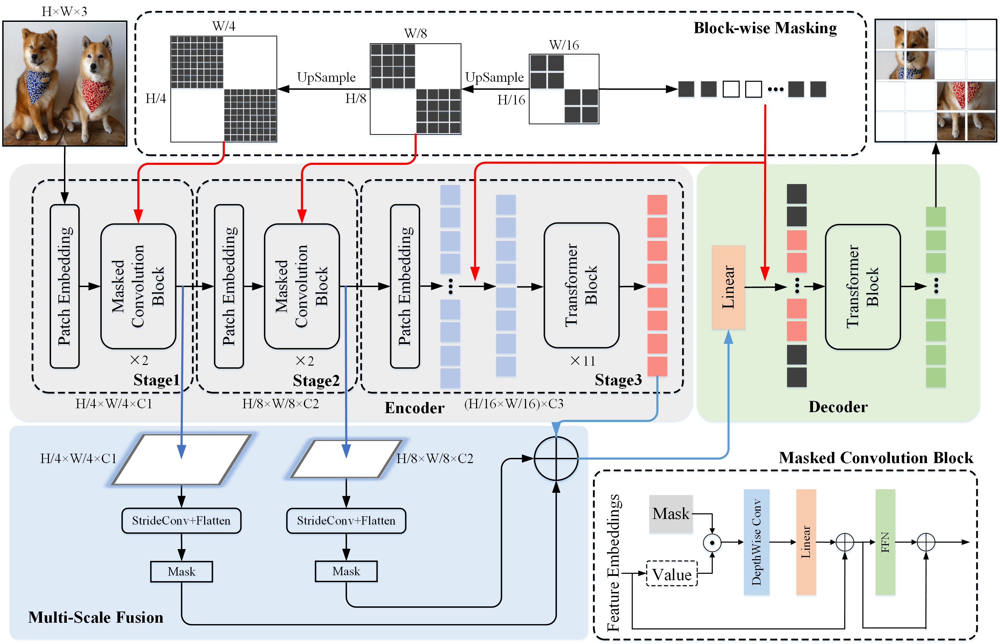

<h1>ConvMAE</h1>
<h3>ConvMAE: Masked Convolution Meets Masked Autoencoders</h3>

[Peng Gao](https://scholar.google.com/citations?user=miFIAFMAAAAJ&hl=en&oi=ao)1, [Teli Ma](https://scholar.google.com/citations?user=arny77IAAAAJ&hl=en&oi=ao)1, [Hongsheng Li](https://scholar.google.com/citations?user=BN2Ze-QAAAAJ&hl=en&oi=ao)2, [Jifeng Dai](https://scholar.google.com/citations?user=SH_-B_AAAAAJ&hl=en&oi=ao)3, [Yu Qiao](https://scholar.google.com/citations?user=gFtI-8QAAAAJ&hl=en&oi=ao)1,

1 [Shanghai AI Laboratory](https://www.shlab.org.cn/), 2 [MMLab, CUHK](https://mmlab.ie.cuhk.edu.hk/), 3 [Sensetime Research](https://www.sensetime.com/cn).

This repo is the official implementation of [ConvMAE: Masked Convolution Meets Masked Autoencoders](). It currently concludes codes and models for the following tasks:
> **ImageNet Pretrain**: See [PRETRAIN.md](PRETRAIN.md).\
> **ImageNet Finetune**: See [FINETUNE.md](FINETUNE.md).\
> **Object Detection**: See [DETECTION.md](DET/DETECTION.md).\
> **Semantic Segmentation**: See [SEGMENTATION.md](SEG/SEGMENTATION.md).

## Introduction
ConvMAE framework demonstrates that multi-scale hybrid convolution-transformer can learn more discriminative representations via the mask auto-encoding scheme. 
* We present the strong and efficient self-supervised framework ConvMAE, which is easy to implement but show outstanding performances on downstream tasks.
* ConvMAE naturally generates hierarchical representations and exhibit promising performances on object detection and segmentation.
* ConvMAE-Base improves the ImageNet finetuning accuracy by 1.4% compared with MAE-Base.
On object detection with Mask-RCNN, ConvMAE-Base achieves 53.2 box AP and 47.1 mask AP with a 25-epoch training schedule while MAE-Base attains 50.3 box AP and 44.9 mask AP with 100 training epochs. On ADE20K with UperNet, ConvMAE-Base surpasses MAE-Base by 3.6 mIoU (48.1 vs. 51.7).

## Main Results on ImageNet-1K
| Models | #Params(M) | Supervision | Encoder Ratio | Pretrain Epochs | FT acc@1(%) | LIN acc@1(%) | logs/weights |
| :---: | :---: | :---: | :---: | :---: | :---: | :---: | :---: |
| BEiT | 88 | DALLE | 100% | 300 | 83.0 | 37.6 | - |
| MAE | 88 | RGB | 25% | 1600 | 83.6 | 67.8 | - |
| SimMIM | 88 | RGB | 100% | 800 | 84.0 | 56.7 | - |
| MaskFeat | 88 | HOG | 100% | 300 | 83.6 | N/A | - |
| data2vec | 88 | RGB | 100% | 800 | 84.2 | N/A | - |
| ConvMAE-B | 88 | RGB | 25% | 1600 | 85.0 | 70.9 | soon |

## Main Results on COCO
### Mask R-CNN
| Models | Pretrain | Pretrain Epochs | Finetune Epochs | #Params(M)| FLOPs(T) | box AP | mask AP | logs/weights |
| :---: | :---: | :---: |:---: | :---: | :---: | :---: | :---: | :---: |
| Swin-B | IN21K w/ labels | 300 | 36 | 109 | 0.7 | 51.4 | 45.4 | - | 
| Swin-L | IN21K w/ labels | 300 | 36 | 218 | 1.1 | 52.4 | 46.2 | - | 
| MViTv2-B | IN21K w/ labels | 300 | 36 | 73 | 0.6 | 53.1 | 47.4 | - | 
| MViTv2-L | IN21K w/ labels | 300 | 36 | 239 | 1.3 | 53.6 | 47.5 | - | 
| Benchmarking-ViT-B | IN1K w/o labels | 1600 | 100 | 118 | 0.9 | 50.4 | 44.9 | - |
| Benchmarking-ViT-L | IN1K w/o labels | 1600 | 100 | 340 | 1.9 | 53.3 | 47.2 | - |
| ViTDet | IN1K w/o labels | 1600 | 100 | 111 | 0.8 | 51.2 | 45.5 | - |
| MIMDet-ViT-B | IN1K w/o labels | 1600 | 36 | 127 | 1.1 | 51.5 | 46.0 | - |
| MIMDet-ViT-L | IN1K w/o labels | 1600 | 36 | 345 | 2.6 | 53.3 | 47.5 | - |
| ConvMAE-B | IN1K w/o lables | 1600 | 25 | 104 | 0.9 | 53.2 | 47.1 | soon |

## Main Results on ADE20K
### UperNet
| Models | Pretrain | Pretrain Epochs| Finetune Iters | #Params(M)| FLOPs(T) | mIoU | logs/weights |
| :---: | :---: | :---: | :---: | :---: | :---: | :---: | :---: |
| DeiT-B | IN1K w/ labels | 300 | 16K | 163 | 0.6 | 45.6 | - |
| Swin-B | IN1K w/ labels | 300 | 16K | 121 | 0.3 | 48.1 | - |
| MoCo V3 | IN1K | 300 | 16K | 163 | 0.6 | 47.3 | -  |
| DINO | IN1K | 400 | 16K | 163 | 0.6 | 47.2 | -  |
| BEiT | IN1K+DALLE | 1600 | 16K | 163 | 0.6 | 47.1 | -  |
| PeCo | IN1K | 300 | 16K | 163 | 0.6 | 46.7 | -  |
| CAE | IN1K+DALLE | 800 | 16K | 163 | 0.6 | 48.8 | -  |
| MAE | IN1K | 1600 | 16K | 163 | 0.6 | 48.1 | -  |
| ConvMAE-B | IN1K | 1600 | 16K | 153 | 0.6 | 51.7 | soon  |

## Getting Started
### Prerequisites
* Linux
* Python 3.7+
* CUDA 10.2+
* GCC 5+

### Training and inference
* See [PRETRAIN.md](PRETRAIN.md) for pretraining.
* See [FINETUNE.md](FINETUNE.md) for pretrained model finetuning and linear probing. 
* See [DETECTION.md](DET/DETECTION.md) for using pretrained backbone on [Mask RCNN](https://openaccess.thecvf.com/content_iccv_2017/html/He_Mask_R-CNN_ICCV_2017_paper.html).
* See [SEGMENTATION.md](SEG/SEGMENTATION.md) for using pretrained backbone on [UperNet](https://openaccess.thecvf.com/content_ECCV_2018/html/Tete_Xiao_Unified_Perceptual_Parsing_ECCV_2018_paper.html).

## Acknowledgement
The pretraining and finetuning of our project are based on [DeiT](https://github.com/facebookresearch/deit) and [MAE](https://github.com/facebookresearch/mae). The object detection and semantic segmentation parts are based on [MIMDet](https://github.com/hustvl/MIMDet) and [MMSegmentation](https://github.com/open-mmlab/mmsegmentation) respectively. Thanks for their wonderful work.

## License
ConvMAE is released under the [MIT License](https://github.com/Alpha-VL/ConvMAE/blob/main/LICENSE).

## Citation

