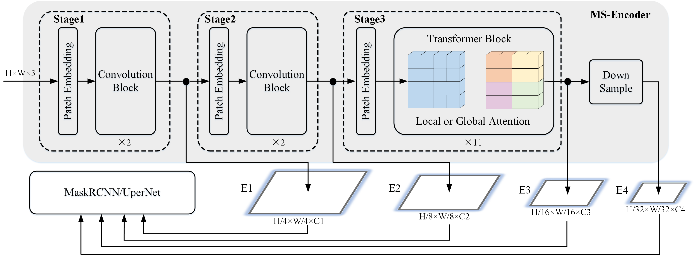

# ConvMAE: Masked Convolution Meets Masked Autoencoders

This folder contains the implementation of the ConvMAE transfer learning for semantic segmentation on ADE-20K. It is based on [MMSegmentation](https://github.com/open-mmlab/mmsegmentation).

## Pipeline



| Models | Pretrain | Pretrain Epochs| Finetune Iters | #Params(M)| FLOPs(T) | mIoU | logs/weights |
| :---: | :---: | :---: | :---: | :---: | :---: | :---: | :---: |
| ConvMAE-B | IN1K | 1600 | 16K | 153 | 0.6 | 51.7 | [log](https://drive.google.com/file/d/1N3LEhEd2FLx8777Kn5tVn5gxYiBTz00A/view?usp=sharing)/[weight](https://drive.google.com/file/d/1aQR_CmZBzN2eHWYgzPUDm4ulme-g9cIR/view?usp=sharing)  |

## Usage

### Install
- Clone this repo:

```bash
git clone https://github.com/Alpha-VL/ConvMAE
cd ConvMAE/SEG
```

- Create a conda environment and activate it:
```bash
conda create -n upernet python=3.7
conda activate upernet
```

- Install `Pytorch==1.8.0` and `torchvision==0.9.0` with `CUDA==11.1`

```bash
conda install pytorch==1.8.0 torchvision==0.9.0 cudatoolkit=11.1 -c pytorch -c conda-forge
```

- Install the [mmsegmentation](https://github.com/open-mmlab/mmsegmentation) library and some required packages.

```bash
pip install mmcv-full==1.3.0 mmsegmentation==0.11.0
pip install scipy timm==0.3.2
```

- Install [apex](https://github.com/NVIDIA/apex) for mixed-precision training

```bash
git clone https://github.com/NVIDIA/apex
cd apex
pip install -v --disable-pip-version-check --no-cache-dir --global-option="--cpp_ext" --global-option="--cuda_ext" ./
```

### Data preparation
Follow the guide in [mmseg](https://github.com/open-mmlab/mmsegmentation/blob/master/docs/en/dataset_prepare.md#ade20k) to prepare the ADE20k dataset.

### Training
Download the pretrained model [here](https://drive.google.com/file/d/1AEPivXw0A0b_m5EwEi6fg2pOAoDr8C31/view?usp=sharing).

```bash
./tools/dist_train.sh <CONFIG_PATH> <NUM_GPUS>  --work-dir <SAVE_PATH> --options model.pretrained=<PRETRAINED_MODEL_PATH>
```

For example:
```bash
./tools/dist_train.sh \
    configs/convmae/upernet_convmae_base_512_slide_160k_ade20k.py 8 \
    --work-dir /path/to/save \
    --options model.pretrained=/path/to/pretrained/weights
```

### Evaluation

Download the fine-tuned checkpoint [here](https://drive.google.com/file/d/1aQR_CmZBzN2eHWYgzPUDm4ulme-g9cIR/view?usp=sharing).
```
./tools/dist_test.sh  <CONFIG_PATH> <CHECKPOINT_PATH> <NUM_GPUS> --eval mIoU
```

Run 
```
./tools/dist_test.sh configs/convmae/upernet_convmae_base_512_slide_160k_ade20k.py /path/to/finetuned/weights 8 --eval mIoU
```

This should give
```
+--------+-------+-------+-------+
| Scope  | mIoU  | mAcc  | aAcc  |
+--------+-------+-------+-------+
| global | 51.66 | 63.88 | 84.45 |
+--------+-------+-------+-------+
```